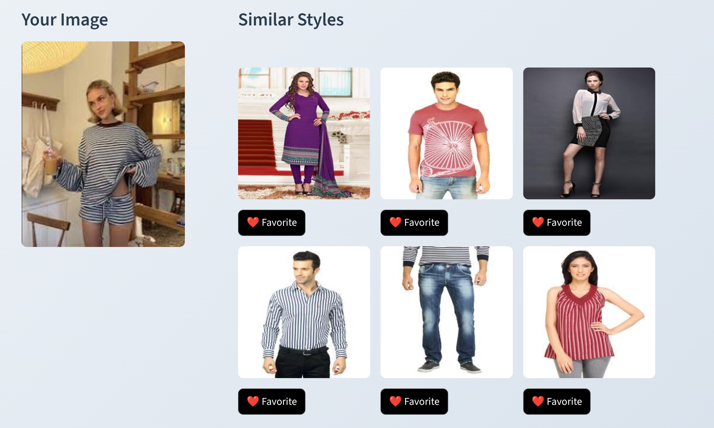

# Fashion Advisor – Image-based Fashion Recommendation
## 🟢 Project is live on https://fashionadvisor.streamlit.app/

A modern Streamlit web app that recommends visually similar fashion items based on an input image. It uses a ResNet50 backbone (ImageNet weights) to extract feature embeddings for a catalog of product images and then finds nearest neighbors using a KNN search.

The app includes user authentication (SQLite), favorites, upload history, and a light/dark theme toggle, making it a complete mini product you can showcase.

---

## Demo



## Features

- Image-based fashion recommendations powered by ResNet50 + feature embeddings
- Streamlit UI with modern styling and light/dark themes
- User authentication (register/login) backed by SQLite
- Upload history per user and favorites collection
- Precomputed embeddings so the app runs out of the box
- Optional training script to regenerate embeddings when you change the dataset

---

## Project Structure

- [app.py](app.py) – Main Streamlit app (login, uploads, favorites, recommendations)
- [train.py](train.py) – Script to build embeddings from images in the `images/` folder
- [test.py](test.py) – Small CLI utility to query similar images from the command line
- [embeddings.pkl](embeddings.pkl) – Precomputed feature embeddings for catalog images
- [filenames.pkl](filenames.pkl) – Corresponding image paths for each embedding
- [images/](images) – Catalog images used for recommendations
- [uploads/](uploads) – User-uploaded images (created at runtime)
- [assets/](assets) – Any additional assets used by the app (optional)
- [requirements.txt](requirements.txt) – Python dependencies
- [Dockerfile](Dockerfile) – Container image definition for running with Docker

---

## Prerequisites (Local / Non-Docker)

- Python 3.9+ (3.10 recommended)
- A working C/C++ toolchain and system libraries compatible with TensorFlow (typical Linux dev tooling is fine)

Install the Python dependencies using `pip`:

```bash
pip install -r requirements.txt
``

> Note: Installing TensorFlow can take some time and may require additional system libraries depending on your OS.

---

## Running the Streamlit App Directly

1. **Clone the repository**

   ```bash
   git clone https://github.com/<your-username>/fashion-advisor.git
   cd fashion-advisor
   ```

2. **(Optional but recommended) Create and activate a virtual environment**

   ```bash
   python -m venv .venv
   source .venv/bin/activate  # On Windows: .venv\\Scripts\\activate
   ```

3. **Install dependencies**

   ```bash
   pip install -r requirements.txt
   ```

4. **Ensure data files exist**

   - The repo already includes [embeddings.pkl](embeddings.pkl) and [filenames.pkl](filenames.pkl) for the images in [images/](images).
   - If you change or replace the catalog under [images/](images), regenerate these files by running:

     ```bash
     python train.py
     ```

5. **Run the Streamlit app**

   ```bash
   streamlit run app.py
   ```

6. **Open the app in your browser**

   Streamlit will print a local URL (usually `http://localhost:8501`). Open it in your browser to use the app.

---

## Using Docker

You can also run the app fully containerized with Docker.

### 1. Build the Docker Image

From the project root (where the Dockerfile lives):

```bash
docker build -t fashion-advisor .
```

### 2. Run the Container

Expose Streamlit on port `8501`:

```bash
docker run --rm -p 8501:8501 fashion-advisor
```

Then open `http://localhost:8501` in your browser.

> Note: Inside the container, uploads and the SQLite database are stored in the container filesystem. For persistent storage between runs, you can mount a local directory to `/app/uploads` and `/app/users.db` as needed.

Example with a volume for uploads:

```bash
docker run --rm -p 8501:8501 \
  -v "$(pwd)/uploads:/app/uploads" \
  fashion-advisor
```

---

## Regenerating Embeddings (When Dataset Changes)

If you add, remove, or change images in [images/](images), you should rebuild the embeddings. This is optional for just *running* the app with the included data, but required to keep recommendations consistent with your catalog.

Run:

```bash
python train.py
```

This will:

- Scan all files in [images/](images)
- Extract ResNet50 features for each image
- Save updated [embeddings.pkl](embeddings.pkl) and [filenames.pkl](filenames.pkl)

---

## Command-Line Testing with test.py

[test.py](test.py) is a small helper script to query the recommendation engine from the command line (independent of Streamlit).

Usage:

```bash
python test.py path/to/your/query_image.jpg --top_k 6
```

This will print the paths of the `top_k` most similar catalog images (according to the embeddings in [embeddings.pkl](embeddings.pkl)).

This script is useful if you want to quickly check how good the embeddings are for a particular query image.

---

## 👤 Author
**Ganesh Neupane**
Computer Engineering | AI / ML
- GitHub: [@GaneshNeupane01](https://github.com/GaneshNeupane01)
- Detail: [@portfolio](https://ganesh-neupane.com.np)

